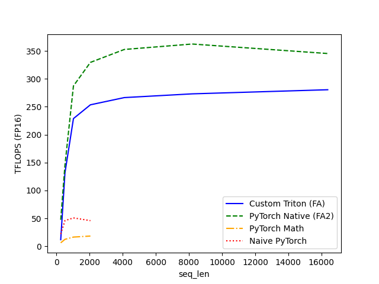

# Triton FlashAttention-2

A high-performance implementation of the **FlashAttention-2** algorithm, written in pure Python using **OpenAI Triton**. 

This kernel is engineered to maximize GPU hardware utilization and minimize memory footprint, enabling the processing of very long sequences (16k+ tokens) by avoiding the quadratic memory bottleneck of standard attention mechanisms.

## Key Features

* **Grouped-Query Attention (GQA)**: Native support for modern LLM architectures such as Llama 3 and Mistral.
* **Dynamic Split-KV**: Implements a workload heuristic that partitions the sequence dimension to maximize Streaming Multiprocessor (SM) occupancy, especially at small batch sizes.
* **Optimized Causal Masking**: Decouples causal logic to allow off-diagonal blocks to execute at peak hardware throughput.
* **Numerical Stability (NaN-Shield)**: Robust handling of `-inf - (-inf)` cases to prevent NaN propagation in `bfloat16` and `float16` during masked reductions.
* **Hardware-Accelerated Addressing**: Utilizes Triton's block pointers for optimal SRAM tiling and memory coalescing.

## Performance Evaluation

Benchmarks conducted on an **NVIDIA H100 NVL** (FP16, BATCH=4, HEADS=8, HEAD_DIM=64):

* **Throughput**: Achieves **~280 TFLOPS**, reaching approximately 80% of the efficiency of the native PyTorch C++/CUDA baseline.
* **Memory Efficiency**: Maintains $O(N)$ complexity, consuming **7.4x less VRAM** than a naive eager implementation at `seq_len=2048`.



## Project Structure

* `kernels/flash_attention.py`: Core `@triton.jit` forward and reduction kernels.
* `main.ipynb`: Comprehensive suite including correctness validation, TFLOPS benchmarking, and memory profiling.

## Requirements
```text
torch>=2.1.0
triton>=2.1.0
```
## Limitations & Future Work

While this kernel achieves high performance for inference and forward-pass computations, it is a scoped implementation. It currently does not include:
* **Backward Pass**: Gradient computation (`dQ`, `dK`, `dV`) for full training loops.
* **Varlen (Packed) Sequences**: Support for ragged batching without padding via `cu_seqlens`.
* **Fused Dropout / Window Attention**: Additional regularizations and local attention masking.

Implementing the Backward pass in Triton is the next logical step for this repository.